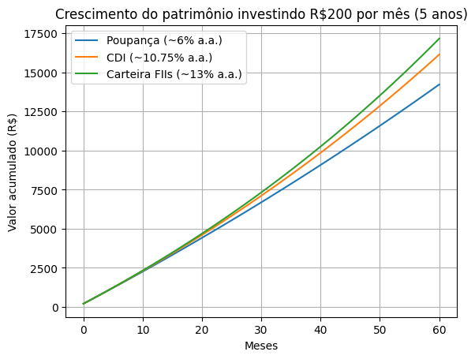

📄 **Projeto em PDF:** [Clique aqui para abrir](projeto_notebookLM.pdf)
📓 **Notebook da simulação (Python):** [simulacao_investimentos.ipynb](simulacao_investimentos.ipynb)

# Como investir ganhando pouco no Brasil

📊 Projeto de análise financeira baseado em dados públicos e simulações de juros compostos, com foco em estratégias acessíveis para pessoas de baixa renda no contexto brasileiro.

---

## 🎯 Objetivo

Analisar, de forma prática e orientada a dados, **como uma pessoa com renda mensal de R$ 2.000 pode iniciar a construção de patrimônio** por meio de aportes constantes e investimentos simples disponíveis no mercado brasileiro.

O projeto busca responder:

> É possível gerar crescimento patrimonial relevante investindo pequenos valores mensais ao longo do tempo?

---

## 🧠 Contexto de negócio

Grande parte da população brasileira acredita que investir exige altos rendimentos iniciais.  
Esse projeto demonstra, por meio de **simulação financeira e análise de cenários**, que disciplina, tempo e juros compostos têm impacto maior que o valor inicial disponível.

---

## 📊 Metodologia de análise

A análise foi estruturada em três etapas:

1. **Definição do cenário financeiro**
   - Renda mensal: R$ 2.000  
   - Taxa de poupança simulada: 10% a 20%  
   - Horizonte temporal: 5 anos  

2. **Coleta de dados públicos**
   - Taxas médias de rendimento (CDI, poupança e FIIs)  
   - Referências educacionais financeiras abertas  
   - Premissas conservadoras de mercado  

3. **Simulação de crescimento patrimonial**
   - Aportes mensais constantes  
   - Aplicação de juros compostos  
   - Comparação entre diferentes classes de ativos  

---

## 📈 Resultados — Aporte de R$ 200/mês

Total investido em 5 anos: **R$ 12.000**

| Investimento        | Valor final aproximado | Lucro estimado |
|---------------------|------------------------|----------------|
| Poupança            | R$ 13.950              | R$ 1.950       |
| CDB / Tesouro Selic | R$ 15.600              | R$ 3.600       |
| Carteira com FIIs   | R$ 16.500              | R$ 4.500       |

### 📊 Visualização

**Insight principal:**  
A simples migração da poupança para renda fixa atrelada ao CDI pode **quase dobrar os juros acumulados** no período analisado.

---

## 📈 Resultados — Aporte de R$ 400/mês

Total investido: **R$ 24.000**

| Investimento        | Valor final aproximado | Lucro estimado |
|---------------------|------------------------|----------------|
| CDB / Tesouro Selic | R$ 31.200              | R$ 7.200       |
| Carteira com FIIs   | R$ 33.000              | R$ 9.000       |

### 📊 Visualização

**Insight principal:**  
O aumento do aporte mensal acelera significativamente o efeito dos **juros compostos**, fazendo com que parte relevante do patrimônio passe a vir dos rendimentos.

---

## 🏆 Estratégias mais eficientes na última década

A análise histórica indica três pilares principais:

- **Renda fixa atrelada ao CDI:** alto retorno com baixo risco em cenários de juros elevados.  
- **Fundos imobiliários com reinvestimento:** geração de renda passiva isenta de imposto.  
- **Tesouro IPCA+:** proteção do poder de compra contra a inflação.

Por outro lado, estratégias como manter recursos na poupança ou investir sem diversificação mostraram **baixo desempenho ou alto risco**.

---

## ⚠️ Erros comuns de iniciantes

- Não criar reserva de emergência  
- Permanecer apenas na poupança  
- Ignorar prazo e liquidez  
- Entrar na renda variável sem preparo  
- Subestimar pequenos aportes  
- Movimentar a carteira com frequência excessiva  

---

## 💡 Conclusão

Os resultados demonstram que:

- **Pequenos aportes mensais são suficientes para iniciar a construção de patrimônio**  
- O fator mais relevante é a **constância no longo prazo**  
- Juros compostos transformam disciplina financeira em crescimento real  

Investir com pouco dinheiro não é uma limitação técnica, mas sim um desafio de **comportamento, organização e tempo**.

---

## 🛠️ Ferramentas utilizadas

- Simulações financeiras em Python  
- Modelagem de juros compostos  
- Documentação e versionamento no GitHub  

---

## 👩‍💻 Autora

**Claudia**  
Projeto desenvolvido como parte da construção de portfólio para transição de carreira para **Análise de Dados**, com foco em problemas financeiros reais.

